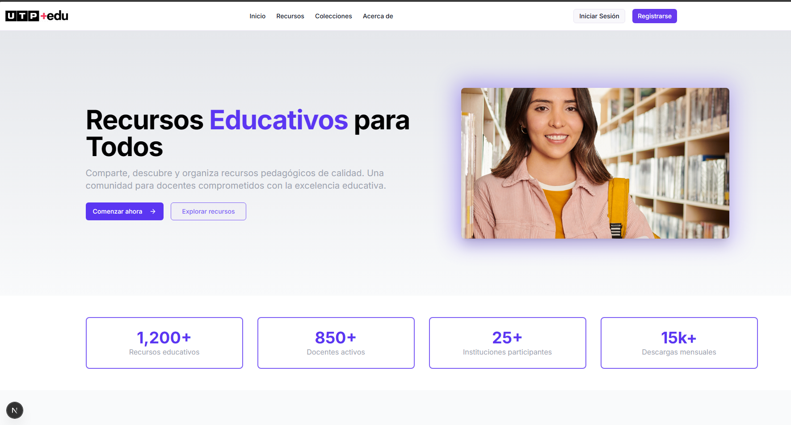
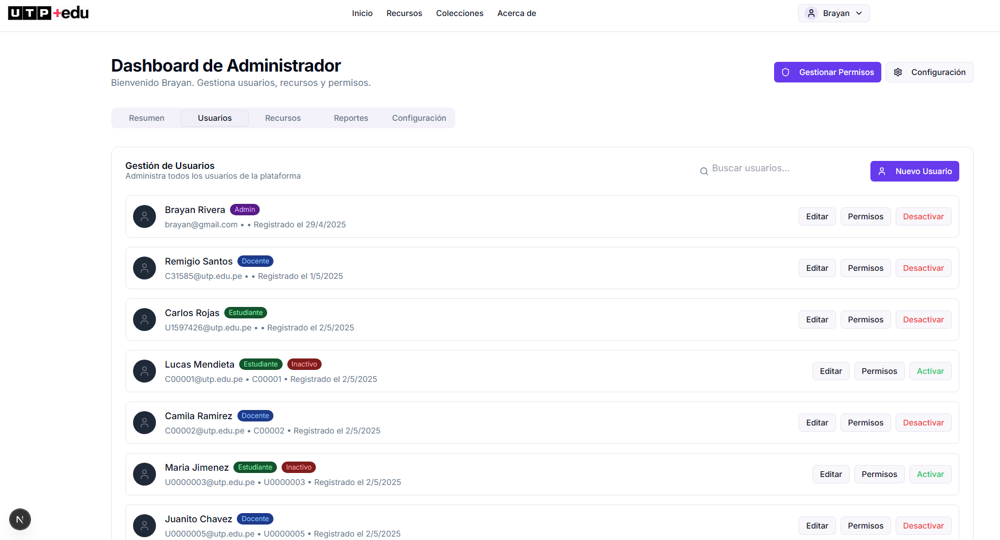
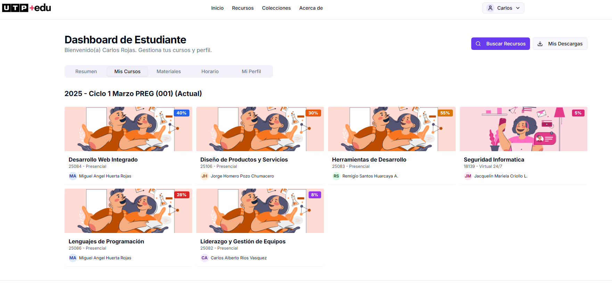
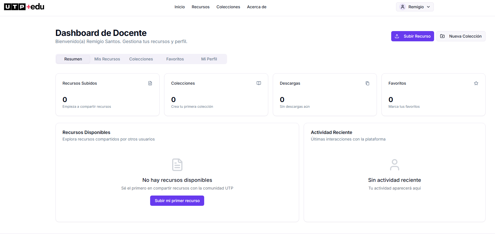

# UTPEDU - Plataforma Educativa Digital 📚

<p align="center">
  
</p>

<p align="center">
  <strong>Sistema integral de gestión de recursos educativos para instituciones universitarias</strong>
</p>

<p align="center">
  
  
  
</p>

<p align="center">
  <a href="https://github.com/BrynRD/UTPEDU/commits/main">
    
  </a>
  <a href="https://github.com/BrynRD/UTPEDU">
    
  </a>
</p>

## 📋 Tabla de Contenidos
- [Descripción General](#-descripción-general)
- [Características Principales](#-características-principales)
- [Arquitectura y Tecnologías](#-arquitectura-y-tecnologías)
- [Servicios Integrados](#-servicios-integrados)
- [Roles de Usuario](#-roles-de-usuario)
- [Capturas de Pantalla](#-capturas-de-pantalla)
- [Instalación y Configuración](#-instalación-y-configuración)
- [Variables de Entorno](#-variables-de-entorno)
- [Estructura del Proyecto](#-estructura-del-proyecto)
- [API Endpoints](#-api-endpoints)
- [Seguridad](#-seguridad)
- [Contribución](#-contribución)

## 🎯 Descripción General

**UTPEDU** es una plataforma web moderna diseñada para la gestión integral de recursos educativos en instituciones universitarias. Facilita la colaboración entre docentes, estudiantes y administradores mediante un sistema de roles diferenciado y herramientas especializadas.

### Propósito
- **Centralizar** todos los recursos educativos en una plataforma única
- **Facilitar** el intercambio de material entre docentes y estudiantes
- **Automatizar** procesos administrativos y de gestión
- **Mejorar** la experiencia educativa digital

## ✨ Características Principales

### 📚 Gestión de Recursos
- **Subida masiva** de archivos educativos (PDF, DOCX, XLSX, PPT, etc.)
- **Almacenamiento en la nube** integrado con Nextcloud
- **Categorización** inteligente de recursos
- **Búsqueda avanzada** con filtros
- **Estadísticas** de descargas y uso

### 👥 Sistema de Usuarios
- **Autenticación segura** con JWT
- **Tres roles diferenciados**: Administrador, Docente, Estudiante
- **Perfiles personalizados** por tipo de usuario
- **Gestión de permisos** granular

### 🔒 Seguridad Avanzada
- **reCAPTCHA v2** para prevenir bots
- **Cifrado de contraseñas** con bcrypt
- **Tokens JWT** para sesiones seguras
- **Validación** de archivos subidos

### 📊 Reportes y Analíticas
- **Dashboard** personalizado por rol
- **Estadísticas** de uso en tiempo real
- **Reportes** de incidencias automáticos
- **Métricas** de engagement

### 🤖 Automatización
- **Notificaciones** automáticas vía Power Automate
- **Gestión de incidencias** integrada
- **Workflows** automatizados para procesos administrativos

## 🏗 Arquitectura y Tecnologías

### Frontend
- **Next.js 14** - Framework React con SSR/SSG
- **TypeScript** - Tipado estático para mayor robustez
- **Tailwind CSS** - Framework CSS utilitario
- **Shadcn/ui** - Componentes UI modernos
- **React Hook Form** - Manejo eficiente de formularios

### Backend
- **Node.js** - Runtime de JavaScript
- **Express.js** - Framework web minimalista
- **JWT** - Autenticación sin estado
- **Multer** - Manejo de archivos multipart
- **Axios** - Cliente HTTP para APIs externas

### Base de Datos
- **MySQL 8.0** - Sistema de gestión de base de datos relacional
- **Diseño normalizado** para optimizar consultas
- **Índices optimizados** para búsquedas rápidas
- **Migraciones** para versionado de esquema

### DevOps
- **Git** - Control de versiones

## 🔌 Servicios Integrados

### 📁 Almacenamiento - Nextcloud
```javascript
// Configuración de Nextcloud para almacenamiento seguro
NEXTCLOUD_URL=https://tu-nextcloud.dominio.com/remote.php/webdav/
NEXTCLOUD_USER=tu_usuario_nextcloud
NEXTCLOUD_PASSWORD=tu_password_nextcloud
```
**Características:**
- Almacenamiento seguro en la nube
- Versionado de archivos
- Acceso controlado por permisos
- Backup automático

### 🤖 Automatización - Power Automate
```javascript
// Webhook para notificaciones automáticas
POWER_AUTOMATE_WEBHOOK=https://prod-xx.westus.logic.azure.com/workflows/xxx
```
**Funcionalidades:**
- Notificaciones automáticas de incidencias
- Workflows de aprobación
- Integración con Microsoft 365
- Alertas en tiempo real

### 🖼️ Gestión de Imágenes - ImgBB
```javascript
// API para subida de imágenes en incidencias
IMGBB_API_KEY=tu_api_key_de_imgbb
```
**Beneficios:**
- Optimización automática de imágenes
- CDN global para carga rápida
- Formatos múltiples soportados

### 🛡️ Seguridad - Google reCAPTCHA
```javascript
// Protección contra bots y spam
RECAPTCHA_SITE_KEY=tu_site_key_de_google_recaptcha
RECAPTCHA_SECRET_KEY=tu_secret_key_de_google_recaptcha
```
**Protección:**
- Validación humana en formularios
- Prevención de ataques automatizados
- Análisis de comportamiento

## 👥 Roles de Usuario

### 🔧 Administrador
- **Gestión completa** de usuarios y recursos
- **Panel de analytics** avanzado
- **Configuración** del sistema
- **Moderación** de contenido
- **Reportes** administrativos

### 👨‍🏫 Docente
- **Subida** de recursos educativos
- **Organización** por categorías
- **Estadísticas** de uso de sus recursos
- **Gestión** de materiales por curso

### 👨‍🎓 Estudiante
- **Acceso** a recursos públicos
- **Descarga** de materiales
- **Búsqueda** avanzada de contenido
- **Reporte** de incidencias

## 📸 Capturas de Pantalla

### 🏠 Página de Inicio


### 🔐 Sistema de Autenticación
 

### 📊 Dashboards por Rol




## 🚀 Instalación y Configuración

### Prerrequisitos
- **Git**
- **Node.js 18+**
- **MySQL 8.0**

### Instalación

1. **Clonar el repositorio:**
```bash
git clone https://github.com/BrynRD/UTPEDU.git
cd UTPEDU
```

2. **Configurar variables de entorno:**
```bash
# Backend
cp backend/.env.example backend/.env
# Frontend  
cp frontend/.env.example frontend/.env.local
```

3. **Configurar la base de datos:**
```bash
# Importar el esquema de base de datos
mysql -u root -p < UTPEDU.sql
```

4. **Instalar dependencias y ejecutar:**

**Backend:**
```bash
cd backend
npm install
npm run dev
```

**Frontend:**
```bash
cd frontend
npm install
npm run dev
```

5. **Acceder a la aplicación:**
- Frontend: http://localhost:3000
- Backend API: http://localhost:3001

> **📋 Estado actual:** [Avance 3 UTPEDU](https://github.com/BrynRD/UTPEDU/commits/main) - Todas las funcionalidades principales implementadas

## 🔧 Variables de Entorno

### Backend (.env)
```bash
# Servidor
PORT=3001
NODE_ENV=development

# Base de datos
DB_HOST=localhost
DB_USER=tu_usuario_db
DB_PASSWORD=tu_password_db
DB_NAME=UTPEDU

# Seguridad
JWT_SECRET=tu_secreto_jwt_muy_seguro_y_largo

# Nextcloud (Almacenamiento)
NEXTCLOUD_URL=https://tu-nextcloud.dominio.com/remote.php/webdav/
NEXTCLOUD_USER=tu_usuario_nextcloud
NEXTCLOUD_PASSWORD=tu_password_nextcloud

# reCAPTCHA
DISABLE_CAPTCHA=false
RECAPTCHA_SITE_KEY=tu_site_key_de_google_recaptcha
RECAPTCHA_SECRET_KEY=tu_secret_key_de_google_recaptcha

# Power Automate
POWER_AUTOMATE_WEBHOOK=tu_webhook_de_power_automate

# ImgBB
IMGBB_API_KEY=tu_api_key_de_imgbb

# ClickUp (Opcional)
CLICKUP_API_TOKEN=tu_token_de_clickup
CLICKUP_TEAM_ID=tu_team_id
CLICKUP_SPACE_ID=tu_space_id
CLICKUP_LIST_ID=tu_list_id_para_incidencias

# Email SMTP (Opcional)
SMTP_HOST=smtp.gmail.com
SMTP_PORT=587
SMTP_USER=tu_email@gmail.com
SMTP_PASSWORD=tu_password_email
```

### Frontend (.env.local)
```bash
# API Backend
NEXT_PUBLIC_API_URL=http://localhost:3001

# reCAPTCHA Frontend
NEXT_PUBLIC_RECAPTCHA_SITE_KEY=tu_site_key_de_google_recaptcha
NEXT_PUBLIC_DISABLE_CAPTCHA=false
```

## 📁 Estructura del Proyecto

```
UTPEDU/
├── 📁 backend/                    # API REST con Node.js
│   ├── 📁 config/                 # Configuración de base de datos
│   ├── 📁 controllers/            # Lógica de negocio
│   │   ├── adminController.js     # Gestión administrativa
│   │   ├── authController.js      # Autenticación y autorización
│   │   ├── categoriaController.js # Gestión de categorías
│   │   ├── recursoController.js   # Gestión de recursos educativos
│   │   └── usuarioController.js   # Gestión de usuarios
│   ├── 📁 middlewares/            # Middleware de autenticación y validación
│   ├── 📁 models/                 # Modelos de datos
│   │   ├── Categoria.js           # Modelo de categorías
│   │   ├── Incidencia.js          # Modelo de incidencias
│   │   ├── Permiso.js             # Modelo de permisos
│   │   ├── Recurso.js             # Modelo de recursos
│   │   └── Usuario.js             # Modelo de usuarios
│   ├── 📁 routes/                 # Definición de rutas API
│   ├── 📁 services/               # Servicios externos (Nextcloud, etc.)
│   ├── 📁 migrations/             # Scripts de base de datos
│   ├── 📁 test/                   # Pruebas unitarias e integración
│   └── app.js                     # Punto de entrada del servidor
├── 📁 frontend/                   # Aplicación Next.js
│   ├── 📁 app/                    # App Router de Next.js 14
│   │   ├── 📁 dashboard/          # Dashboards por rol
│   │   │   ├── 📁 admin/          # Panel administrativo
│   │   │   ├── 📁 docente/        # Panel de docentes
│   │   │   └── 📁 estudiante/     # Panel de estudiantes
│   │   ├── 📁 login/              # Página de autenticación
│   │   ├── 📁 registro/           # Página de registro
│   │   └── layout.tsx             # Layout principal
│   ├── 📁 components/             # Componentes reutilizables
│   │   ├── 📁 ui/                 # Componentes base (Shadcn/ui)
│   │   └── 📁 dashboard/          # Componentes específicos de dashboards
│   ├── 📁 contexts/               # Context providers (Auth, etc.)
│   ├── 📁 lib/                    # Utilidades y configuración
│   │   ├── api.ts                 # Cliente API
│   │   └── utils.ts               # Funciones utilitarias
│   └── 📁 public/                 # Recursos estáticos
├── 📄 UTPEDU.sql                  # Script de base de datos
├── 📄 SECURITY.md                 # Documentación de seguridad
└── 📄 README.md                   # Este archivo
```

## 🔌 API Endpoints

### 🔐 Autenticación
```http
POST   /api/auth/login           # Iniciar sesión
POST   /api/auth/registro        # Registrar usuario
POST   /api/auth/logout          # Cerrar sesión
GET    /api/auth/profile         # Obtener perfil del usuario
```

### 👥 Usuarios
```http
GET    /api/usuarios             # Listar usuarios (Admin)
POST   /api/usuarios             # Crear usuario (Admin)
PUT    /api/usuarios/:id         # Actualizar usuario
DELETE /api/usuarios/:id         # Eliminar usuario (Admin)
GET    /api/usuarios/stats       # Estadísticas de usuarios
```

### 📚 Recursos Educativos
```http
GET    /api/recursos             # Listar recursos (autenticado)
GET    /api/recursos/publicos    # Listar recursos públicos
POST   /api/recursos             # Crear recurso (Docente+)
PUT    /api/recursos/:id         # Actualizar recurso
DELETE /api/recursos/:id         # Eliminar recurso
GET    /api/recursos/:id/download # Descargar recurso
GET    /api/recursos/estadisticas # Estadísticas de recursos
```


### 🚨 Incidencias
```http
GET    /api/incidencias          # Listar incidencias
POST   /api/incidencias          # Reportar incidencia
PUT    /api/incidencias/:id      # Actualizar estado (Admin)
DELETE /api/incidencias/:id      # Eliminar incidencia (Admin)
```

### 📊 Administración
```http
GET    /api/admin/dashboard      # Dashboard administrativo
GET    /api/admin/users          # Gestión de usuarios
GET    /api/admin/resources      # Gestión de recursos
GET    /api/admin/statistics     # Estadísticas globales
```

## ️ Seguridad

### Medidas Implementadas

#### 🔐 Autenticación y Autorización
- **JWT Tokens** con expiración configurable
- **Bcrypt** para hash de contraseñas (salt rounds: 12)
- **Middleware de autenticación** en rutas protegidas
- **Validación de roles** por endpoint

#### 🤖 Protección Anti-Bot
- **Google reCAPTCHA v2** en formularios críticos
- **Rate limiting** para prevenir ataques de fuerza bruta
- **Validación CSRF** en formularios

#### 📁 Seguridad de Archivos
- **Validación de tipos** de archivo permitidos
- **Límites de tamaño** de archivo
- **Escaneado** de malware (configurable)
- **Almacenamiento seguro** en Nextcloud

#### 🔍 Validación de Datos
- **Sanitización** de inputs
- **Validación** de esquemas con Joi
- **Escape** de caracteres especiales
- **Prevención** de inyección SQL

## 🤝 Contribución

### 📋 Estado del Proyecto
> **🚀 Versión Actual:** [Avance 3 UTPEDU](https://github.com/BrynRD/UTPEDU/commits/main)  
> **📅 Última actualización:** Julio 2025  
> **🌐 Repositorio:** [https://github.com/BrynRD/UTPEDU](https://github.com/BrynRD/UTPEDU)  
> **💻 Último commit:** [Avance 3 UTPEDU](https://github.com/BrynRD/UTPEDU/commits/main) - Sistema completo implementado

### ✅ Funcionalidades Completadas
- ✅ Sistema de autenticación JWT completo
- ✅ Dashboard diferenciado por roles (Admin, Docente, Estudiante)
- ✅ Gestión de recursos educativos con Nextcloud
- ✅ Sistema de incidencias con Power Automate
- ✅ Seguridad implementada (reCAPTCHA, validaciones)
- ✅ API REST completa y documentada
- ✅ Frontend responsivo con Next.js 14

### 🤖 Cómo Contribuir

1. **Fork** del repositorio en [GitHub](https://github.com/BrynRD/UTPEDU)
2. **Crear rama** para nueva feature:
   ```bash
   git checkout -b feature/nueva-funcionalidad
   ```
3. **Commit** con mensaje descriptivo:
   ```bash
   git commit -m "feat: agregar nueva funcionalidad"
   ```
4. **Push** a la rama:
   ```bash
   git push origin feature/nueva-funcionalidad
   ```
5. **Abrir Pull Request** con descripción detallada

---

<p align="center">
  <strong>Desarrollado para la educación digital</strong><br>
  <small>© 2025 UTPEDU - Universidad Tecnológica del Perú</small>
</p>

<p align="center">
  <a href="#utpedu---plataforma-educativa-digital-">⬆️ Volver al inicio</a>
</p>
